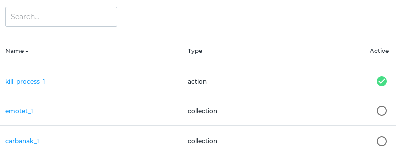
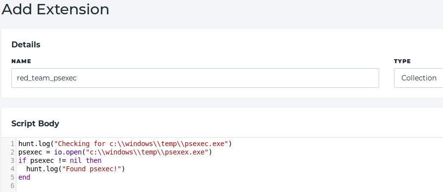

# RESPONSE Extensions
The [Infocyte](https://www.infocyte.com) platform is an agentless Threat Hunting and Incident Response platform. In addition to
the plethora of native host data collection and analysis provided by default, users are able to define their own collections and
response action to be performed on endpoints and servers. Here you will find examples and contributed extensions which can be easily loaded
into the Infocyte platform.

**This repo contains:**
- [Extension Overview](#overview)
- [Usage Instructions](#usage)
- [API Reference](#api)
- [Examples](#examples)
- [Contributing Instructions](#contributing)
- [Feature Requests](#feature-requests)
- [Learn Lua](#learn-lua)

### Overview
The Infocyte extension system is built on top of [Lua 5.3](https://www.lua.org), which provides an easy to deploy, cross platform, and feature-rich library of built-in functions. This includes file system, string , I/O, math, operations (among others). Refer
to the [Lua Reference Manual](https://www.lua.org/manual/5.3/contents.html) for detailed documentation on usage or you can click [here](#learn-lua) for Lua tutorials.

In addition to the Lua standard library, Infocyte exposes the full capabilities of its' agent and endpoint collector ("Survey") that make interacting with host operating systems more powerful and convenient. This extended language is the real engine
that powers the extension system. With these enhancements, extension authors can easily perform web requests,
access the windows registry, terminate running processes, even add items to the existing result set retrieved
by the platform's standard host collection routine. Examples also exist to call other types of scripts like Powershell, Python or Bash depending on availability of the relevant interpreter on the host.

There are currently two types of extensions supported: Collection & Action.

##### Collection
Collection extensions extend what is collected or inspected at scan time. This can be additional registry keys or files to be analyzed or YARA signatures to be used on the host-side. Threat statuses can be flagged based on your logic and text fields are available for arbitrary data collection up to 3MB in size. For large evidence collection, we will have functions available to push data direct from the host to a user provided AWS S3 Bucket, sFTP, or SMB share.

##### Action
Action Extensions cause direct changes to remote systems. These can be remediation actions like host isolation, malware killing, host hardening routines (like changing local logging configurations), or other installing 3rd party tools.


### Usage
Configuring of new extensions is a very simple process. After logging into your Infocyte instance (with
an administrator role) simply navigate to `Admin->Extensions`. Here you can see the list of current extensions
loaded into the system:



Clicking on an existing item will allow you to view the extension body and edit it. To add a new extension click
the `Add Extension`, this will take to you to the extension editor:



You can copy and paste an extension from this repository (check the [contrib folder](/contrib) for submitted extensions),
or start from scratch and write your own.

Hitting save will perform a syntax validation and if everything checks out, will save the newly created extension
for use. To make the extension available to deploy during a scan, make sure you click the `Active` column
to enable it as an option.

*Note: The roadmap has us separating action extensions into their own workflow within the interface.*

### API Reference
Below is documentation surrounding the extended Lua API developed and provided by Infocyte. This API can be broken
down into various parts:

- [Environmental](#environmental)
- [Network](#network)
- [Web](#web)
- [Process](#process)
- [Registry](#registry)
- [Hashing](#hashing)

#### Environmental

##### hunt.log(string)
Captures the input value and saves it to the extension output object to be viewed later in the HUNT application.
It is important to note that this is the only way to make data viewable in HUNT. Any other output will be ignored.

##### hunt.env.os()
Returns a string representing the current operating system.

##### hunt.env.has_python()
Returns a boolean indicating if any version of Python is available on the system.

##### hunt.env.has_python2()
Returns a boolean indicating if Python 2 is available on the system.

##### hunt.env.has_python3()
Returns a boolean indicating if Python 3 is available on the system.

##### hunt.env.has_powershell()
Returns a boolean indicating if Powershell is available on the system.

##### hunt.env.has_sh()
Returns a boolean indicating if the bourne shell is available on the system.

#### Network

##### hunt.net.api()
Returns a string value of the HUNT instance URL the script is currently attached to. This can be empty if the
script is being executed as a test or off-line scan.

##### hunt.net.api_ipv4()
Returns a list of IPv4 addresses associated with the HUNT API, this list can be empty if executed under testing or as an
off-line scan;

##### hunt.net.api_ipv6()
Returns a list of IPv6 addresses associated with the HUNT API, this list can be empty if executed under testing or as an
off-line scan;

##### hunt.net.nslookup(string)
Returns a list of IP addresses associated with the input item. This will be empty if lookup fails.

##### hunt.net.nslookup4(string)
Returns a list of IPv4 addresses associated with the input item. This will be empty if lookup fails.

##### hunt.net.nslookup6(string)
Returns a list of IPv6 addresses associated with the input item. This will be empty if lookup fails.

#### Web
For web requests, a proxy field is available but optional (can be set to `nil` if not needed). The
format for using a proxy is `user:password@proxy_address:port`.

The `enforce_tls` option controls whether or not any TLS/SSL server certificate should be validated.
This is helpful when using internal web servers that may not have a globally recognized certificate.

##### hunt.web.download_file(url: string, local_file: string, enforce_tls: bool, proxy: string)
Retrieves data from `url` and writes the body contents to `local_file`.

##### hunt.web.download_data(url: string, enforce_tls: bool, proxy: string)
Returns the response body as raw bytes.

#### Process

##### hunt.process.kill_pid(pid: number)
Ends the process identified by `pid`

##### hunt.process.kill_process(name: string)
Ends any process with `name`.

#### Registry
These registry functions interact with the `Nt*` series of Windows APIs and therefore use `\Registry\Users`
style of registry paths. These functions will return empty values when run on platforms other than Windows.

##### hunt.registry.list_keys(path: string)
Returns a list of registry keys located at `path`. This will be empty on failure.

##### hunt.registry.list_values(path: string)
Returns a list of registry values located at `path`. This will be empty on failure.

#### Hashing

##### hunt.hash.sha256(path: string)
Returns the string hash of the file

##### hunt.hash.sha256_data(data)
Returns the string hash of a data blob

##### hunt.hash.sha1(path: string)
Returns the string hash of the file

##### hunt.hash.sha1_data(data)
Returns the string hash of a data blob

##### hunt.hash.md5(path: string)
Returns the string hash of the file

##### hunt.hash.md5_data(data)
Returns the string hash of a data blob

##### hunt.hash.fuzzy(path: string)
Returns the string hash of the file

##### hunt.hash.fuzzy_data(data)
Returns the string hash of a data blob

### Examples

```lua
hunt.log("My first HUNT extension!")
```

### Contributing
Infocyte welcomes any contributions to this repository. The preferred method is to
[open a pull request](https://help.github.com/en/articles/about-pull-requests)
with a description of the incoming extension.

### Feature Requests
If there is a feature you would like seen added to the extension system, feel free to open an issue with a
description of the new capability!

### Learn lua
- [LearningLua (Official Tutorial)](http://lua-users.org/wiki/LearningLua)
- [Learn Lua in 15 Minutes](http://tylerneylon.com/a/learn-lua/)
